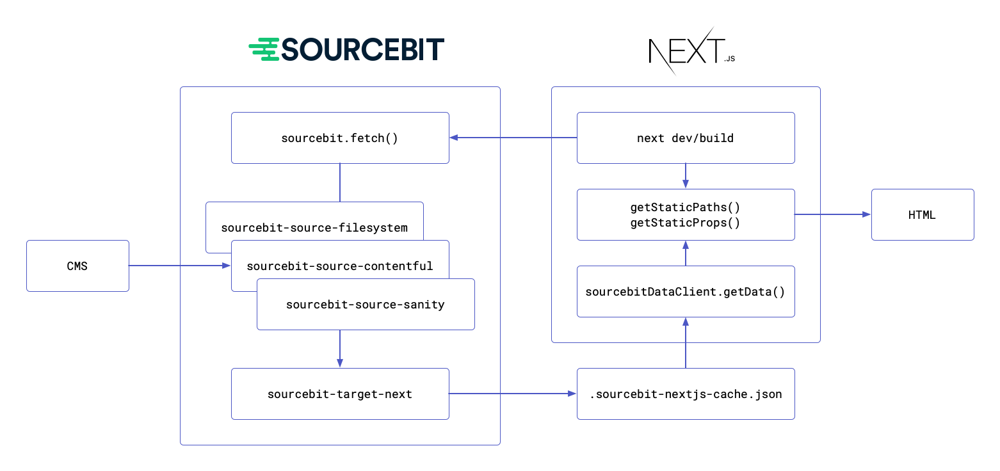

# sourcebit-target-next

[](https://badge.fury.io/js/sourcebit-target-next)

> A [Sourcebit](https://github.com/stackbithq/sourcebit) target plugin for the [Next.js](https://nextjs.org/) framework.

## Overview

This plugin allows consuming content loaded by any of the Sourcebit source plugins (e.g., [sourcebit-source-filesystem], 
[sourcebit-source-contentful] , [sourcebit-source-sanity]) inside Next.js pages using [getStaticProps] and [getStaticPaths]
methods.

1. When Next.js starts, it loads Sourcebit and runs its `fetch()` method that executes Sourcebit plugins.
2. A Sourcebit source plugin loads the content from a CMS or a file-system.
3. The `sourcebit-target-next` plugin caches the loaded content and saves it inside the `.sourcebit-nextjs-cache.json` file.
4. When Next.js renders a page, it calls [getStaticProps] and [getStaticPaths] methods. These methods call
   the `sourcebitDataClient.getData()` method to load the content cached inside the `.sourcebit-nextjs-cache.json` file and
   reduce it according to the needs of a particular page. 



## Installation

1. Install the main `sourcebit` package, this `sourcebit-target-next` plugin, and one of the Sourcebit "source" plugins to fetch your content (e.g., [sourcebit-source-filesystem],
   [sourcebit-source-contentful], [sourcebit-source-sanity], or create your own).

    ```
    npm install sourcebit sourcebit-target-next sourcebit-source-filesystem
    ```

2. Create `sourcebit.js` configuration file in the root of your Next.js project:

   ```javascript
   const path = require('path');
   const isDev = process.env.NODE_ENV === 'development';
   
   module.exports = {
       plugins: [
           /**
            * The `sourcebit-source-filesystem` plugin reads content files from the provided `options.sources` folders,
            * and generates an array of objects that is passed to the subsequent plugins.
            */
           {
               module: require('sourcebit-source-filesystem'),
               options: {
                   watch: isDev,
                   sources: [
                       { name: 'pages', path: path.join(__dirname, 'content/pages') },
                       { name: 'data', path: path.join(__dirname, 'content/data') }
                   ]
               }
           },
   
           /**
            * If needed, add more plugins to transform the data
            */
           ({ data }) => {
               return {
                   ...data,
                   objects: data.objects.map((object) => {
                       // ... trasnform the objects
                       return object;
                   })
               };
           },
   
           /**
            * The `sourcebit-target-next` plugin receives the data generated by `sourcebit-source-filesystem` plugin,
            * and stores it in `.sourcebit-nextjs-cache.json` file.
            */
           {
               module: require('sourcebit-target-next'),
               options: {
                   liveUpdate: isDev,
                   flattenAssetUrls: true
               }
           }
       ]
   };
   ```

3. Wrap the config exported in `next.config.js` in the following way:

    ```js
    const withSourcebit = require('sourcebit').sourcebitNext();
    
    module.exports = withSourcebit({
        // ... next.js config ...
    });
    ```
   
    The `withSourcebit` function loads the `sourcebit.js` config file and runs `sourcebit.fetch(config)` method for you,
    before starting the Next.js server. If you want to control the process yourself, you can load the sourcebit config and call
    `fetch()` manually:

    ```js
    const sourcebit = require('sourcebit');
    const sourcebitConfig = require('./sourcebit.js');
    sourcebit.fetch(sourcebitConfig);
    ```

4. To consume data fetched by Sourcebit and cached by `sourcebit-target-next`, import the `sourcebitDataClient` from
   `sourcebit-target-next` and call its `getData()` method inside `getStaticPaths` and `getStaticProps` methods. You
   can use one of the `__metadata` properties added by `sourcebit-source-filesystem` to generate props needed for a
   particular page.

   - If a page does not use [dynamic routes], then it should call the `getData()` method from `getStaticProps` to load
     the cached data and compute the props specific to that page:

     ```javascript
     // src/pages/about.js
   
     import { sourcebitDataClient } from 'sourcebit-target-next';

     export async function getStaticProps() {
         const data = await sourcebitDataClient.getData();
         const props = data.objects.find((object) => object?.__metadata?.relSourcePath === 'about.md')
         return { props };
     }
     ```

   - If a page does use [dynamic routes], e.g., `src/pages/[[...slug]].js`, then it should have both the `getStaticPaths`
     and the `getStaticProps` methods. Use `getData()` in `getStaticPaths` to generate paths for all your pages, and
     then in `getStaticProps` to compute props for a particular page according to the slug parameter.
     
     ```javascript
     // src/pages/[[...slug]].js
     
     import { sourcebitDataClient } from 'sourcebit-target-next';

     export async function getStaticPaths() {
         const data = await sourcebitDataClient.getData();
         const paths = data.objects
             // find objects loaded from the "pages" folder (__metadata.sourceName === "pages")
             .filter((object) => object?.__metadata?.sourceName === 'pages')
             // map the file path to the page url, e.g.: 'about.md' => '/about'
             .map((object) => urlPathFromFilePath(object?.__metadata?.relSourcePath))
         return { paths };
     }
     
     export async function getStaticProps() {
         const urlPath = '/' + (params?.slug || []).join('/');
         const data = await sourcebitDataClient.getData();
         // find the objects corresponding to the requested page
         const props = data.objects.find((object) => urlPathFromFilePath(object?.__metadata?.relSourcePath) === urlPath);
         return { props };
     }
     ```

5. When working locally, you might want the browser to automatically reflect any content changes.
   To do that, wrap your pages with the following higher order component:

    ```js
    import { withRemoteDataUpdates } from 'sourcebit-target-next/with-remote-data-updates';

    class Page extends React.Component {
        render() {
            // ...
        }
    }

    export default withRemoteDataUpdates(Page);
    ```

## Sourcebit Configuration

This plugin can be configured with several options:

```js
// sourcebit.js

const isDev = process.env.NODE_ENV === 'development';

module.exports = {
    plugins: [
        // ...otherPlugins,
        {
            module: require('sourcebit-target-next'),
            options: {
                liveUpdate: isDev,
                cacheFilePath: path.join(__dirname, '.custom-filename.json'),
                disableCache: false,
                flattenAssetUrls: true
            }
        }
    ]
};
```

- `liveUpdate` (boolean) A flag indicating if page should reload its data when the underlying content changes.
   Defaults to `true` when `NODE_ENV` is set to `development`.
- `cacheFilePath` (string) A file path for cached data, default is `.sourcebit-nextjs-cache.json`
- `disableCache` (boolean) A flag indicating if plugin should produce the cache file. Note, if you set this flag to true
  you won't be able to use `sourcebitDataClient` to consume the data and will have to call `sourcebit.fetch()` for every page.
- `flattenAssetUrls` (boolean) Some source plugins might return complex objects for linked assets. Set this flag to `true`
  to replace these objects with a string representing the absolute asset URL.

You can check out an [example project](https://github.com/stackbit-themes/stackbit-sanity-starter) that uses
`sourcebit-source-sanity` and `sourcebit-target-next` plugins to fetch the data from [Sanity.io](https://www.sanity.io/)
and consume it inside Next.js pages.

## Tips

Add following to your `.gitignore`:

```
.sourcebit-nextjs-cache.json
```

To simplify the dynamic routing architecture and to allow greater flexibility
when creating pages in Headless CMS, we advise using following pattern:

`pages/[[...slug]].js`

```js
import React from 'react';
import { sourcebitDataClient } from 'sourcebit-target-next';
import { withRemoteDataUpdates } from 'sourcebit-target-next/with-remote-data-updates';
import pageLayouts from '../layouts';

class Page extends React.Component {
    render() {
        // every page can have different layout, pick the layout based on the "layout" property of the page
        const PageLayout = pageLayouts[_.get(this.props, 'page.layout')];
        return <PageLayout {...this.props} />;
    }
}

export default withRemoteDataUpdates(Page);

export async function getStaticPaths() {
    const data = await sourcebitDataClient.getData();
    const paths = data.objects
        // find objects loaded from the "pages" folder (__metadata.sourceName === "pages")
        .filter((object) => object?.__metadata?.sourceName === 'pages')
        // map the file path to the page url, e.g.: 'about.md' => '/about'
        .map((object) => urlPathFromFilePath(object?.__metadata?.relSourcePath))
    return {
        paths,
        fallback: false
    };
}

export async function getStaticProps({ params }) {
    const urlPath = '/' + (params?.slug || []).join('/');
    const data = await sourcebitDataClient.getData();
    // find the objects corresponding to the requested page
    const props = data.objects.find((object) => urlPathFromFilePath(object?.__metadata?.relSourcePath) === urlPath);
    return { props };
}
```

[Next.js SSG capabilities]: https://nextjs.org/blog/next-9-3#next-gen-static-site-generation-ssg-support
[sourcebit-source-filesystem]: https://github.com/stackbit/sourcebit-source-filesystem
[sourcebit-source-contentful]: https://github.com/stackbit/sourcebit-source-contentful
[sourcebit-source-sanity]: https://github.com/stackbit/sourcebit-source-sanity
[getStaticProps]: https://nextjs.org/docs/basic-features/data-fetching#getstaticprops-static-generation
[getStaticPaths]: https://nextjs.org/docs/basic-features/data-fetching#getstaticpaths-static-generation
[dynamic routes]: https://nextjs.org/docs/routing/dynamic-routes
